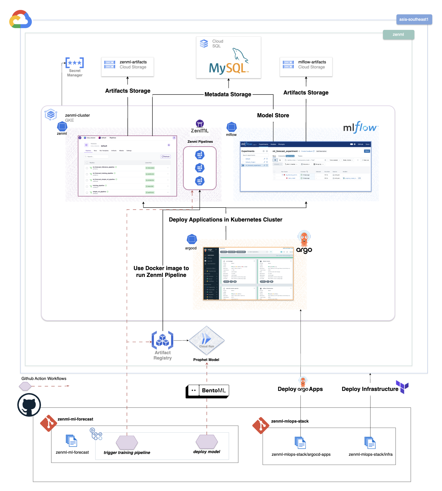

# ZenML MLOps Stack on Google Cloud

[](https://Philippe-Neveux.github.io/zenml-mlops-stack)
[](LICENSE)
[](https://www.terraform.io/)
[](https://cloud.google.com/kubernetes-engine/docs/concepts/autopilot-overview)

A complete production-ready MLOps infrastructure deployment using Terraform, ArgoCD, and Kubernetes on Google Cloud Platform. This repository provides automated infrastructure provisioning and GitOps-based application deployment for a comprehensive ZenML stack.



## 🚀 Quick Start

Deploy a complete MLOps stack in 15 minutes:

```bash
# 1. Clone and configure
git clone https://github.com/Philippe-Neveux/zenml-mlops-stack.git
cd zenml-mlops-stack
export PROJECT_ID="your-project-id"

# 2. Deploy infrastructure
cd src/infra
terraform init
terraform apply -var="project_id=$PROJECT_ID"

# 3. Deploy applications  
kubectl apply -f ../argocd-apps/

# 4. Access services
echo "ZenML: https://zenml-server.$(terraform output -raw nginx_ingress_ip).nip.io"
echo "MLflow: https://mlflow.$(terraform output -raw nginx_ingress_ip).nip.io"
```

## 🏗️ What's Included

### Infrastructure Components
- **GKE Autopilot Cluster** - Fully managed Kubernetes with auto-scaling
- **Cloud SQL MySQL** - Managed database for metadata storage  
- **Cloud Storage & Artifact Registry** - ML artifacts and container images
- **VPC & Security** - Private networking with IAM and encryption

### Application Stack
- **ZenML Server** - ML pipeline orchestration and model registry
- **MLflow Server** - Experiment tracking and model serving
- **ArgoCD** - GitOps continuous deployment
- **NGINX Ingress + cert-manager** - HTTPS access with automatic certificates

## 📋 Prerequisites

- **Google Cloud Project** with billing enabled
- **Tools**: `gcloud`, `terraform`, `kubectl`, `helm`
- **Permissions**: Project Owner or Editor role

[→ Detailed Prerequisites Guide](https://your-docs-url.github.io/getting-started/prerequisites/)

## 🎯 Use Cases

Perfect for:
- **ML Teams** wanting production-ready infrastructure  
- **Data Scientists** needing experiment tracking and model registry
- **DevOps Engineers** implementing MLOps best practices
- **Organizations** adopting GitOps workflows

## 📚 Documentation

**📖 [Complete Documentation](https://Philippe-Neveux.github.io/zenml-mlops-stack/)**

### Quick Links
- [**Getting Started**](https://your-docs-url/getting-started/) - Step-by-step deployment guide
- [**Infrastructure**](https://your-docs-url/infrastructure/) - Terraform modules and architecture
- [**Applications**](https://your-docs-url/applications/) - ZenML, MLflow, and ArgoCD setup  
- [**Configuration**](https://your-docs-url/configuration/) - HTTPS, certificates, and secrets
- [**Troubleshooting**](https://your-docs-url/troubleshooting/) - Common issues and solutions

## 🛠️ Deployment Options

### Quick Deployment (Testing)
- Uses default configurations and nip.io domains
- Single-zone deployment for cost efficiency
- Perfect for evaluation and development

### Production Deployment  
- Custom domain with DNS configuration
- Multi-zone high availability setup
- Advanced security and monitoring
- Backup and disaster recovery

[→ Compare Deployment Options](https://your-docs-url.github.io/getting-started/)

## 🔧 Management

```bash
# Check infrastructure status
terraform output

# Monitor applications
kubectl get applications -n argocd
kubectl get pods --all-namespaces

# View service URLs
kubectl get ingress --all-namespaces

# Check certificates
kubectl get certificates --all-namespaces
```

## 🚨 Support

- **🐛 Issues**: [GitHub Issues](https://github.com/Philippe-Neveux/zenml-mlops-stack/issues)
- **📖 Documentation**: [Complete Docs](https://Philippe-Neveux.github.io/zenml-mlops-stack/)
- **💬 Community**: [ZenML Slack](https://zenml.io/slack-invite/) | [ArgoCD Discussions](https://github.com/argoproj/argo-cd/discussions)

## 🤝 Contributing

Contributions are welcome! Please see our [Contributing Guide](CONTRIBUTING.md) for details.

1. Fork the repository
2. Create a feature branch
3. Make your changes  
4. Add tests and documentation
5. Submit a pull request
