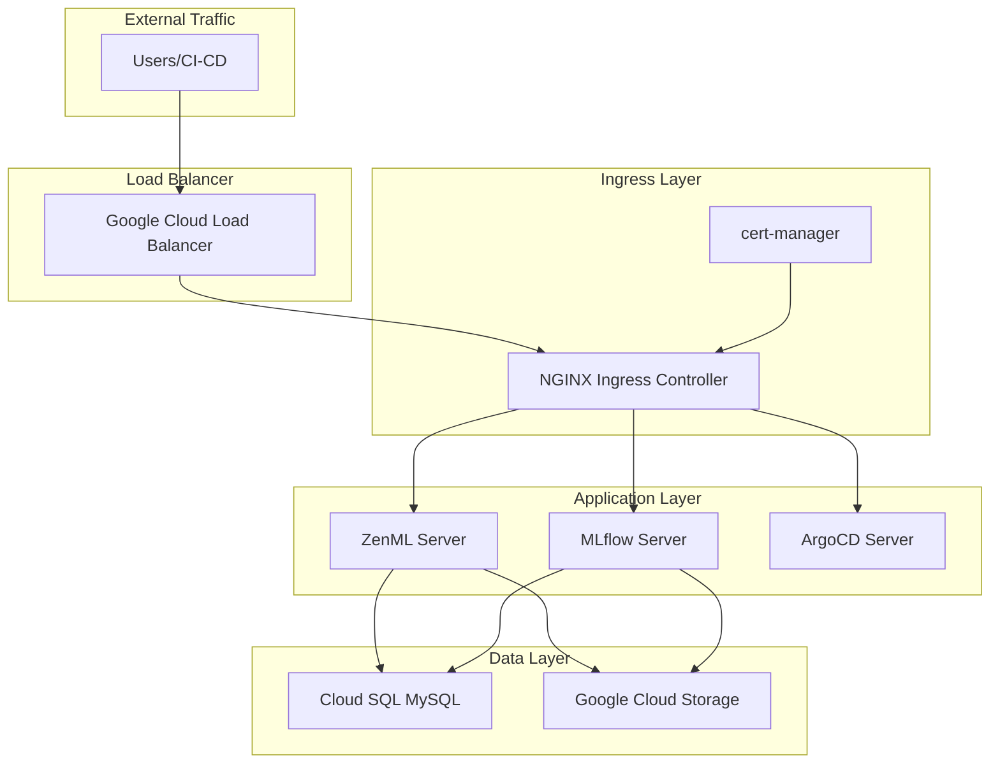

# Applications

The ZenML MLOps stack includes several key applications deployed using GitOps principles with ArgoCD for declarative, version-controlled application management.

## 🎯 Application Stack

### Core Applications
- **ArgoCD** - GitOps continuous deployment platform
- **Zenml Server** - ML pipeline orchestration and model registry  
- **MlFlow** - Experiment tracking and model serving

### Supporting Applications
- **NGINX Ingress Controller** - HTTP/HTTPS traffic routing
- **cert-manager** - Automatic TLS certificate management
- **External Secrets Operator** - Secure secret synchronization

## 🔄 GitOps Deployment

Applications are deployed using ArgoCD with synchronized deployment waves:

| Wave | Applications | Purpose |
|------|-------------|----------|
| 0 | External Secrets Operator | Secret management foundation |
| 1 | Secret Store Configuration | Connect to Google Secret Manager |
| 2 | cert-manager | Certificate management setup |
| 3 | NGINX Ingress, Cluster Issuers | Traffic routing and TLS |
| 4 | ZenML RBAC, ZenML Server | ML platform deployment |
| 5 | MLflow Infrastructure, MLflow Server | Experiment tracking |

## 📊 Application Architecture



## 🚀 Deployment Process

### 1. Infrastructure First
- VPC, GKE, Cloud SQL, and IAM deployed via Terraform
- Static IP addresses and DNS configuration
- Service accounts and security policies

### 2. ArgoCD Installation  
- Deployed directly via kubectl (bootstrap)
- Manages all subsequent application deployments
- Provides GitOps workflow and UI

### 3. Application Deployment
- Applications defined as ArgoCD Applications
- Automatic synchronization from Git repository
- Dependency management via sync waves

## 🔧 Application Configuration

### Helm Values Override Pattern
Each application uses custom values for environment-specific configuration:

```yaml
# ZenML custom values
zenml:
  serverURL: https://zenml.yourdomain.com
  database:
    url: mysql://zenml@private-ip:3306/zenml
    
serviceAccount:
  annotations:
    iam.gke.io/gcp-service-account: zenml@project.iam.gserviceaccount.com
```

### External Secrets Integration
Sensitive configuration is managed through External Secrets Operator:

```yaml
apiVersion: external-secrets.io/v1beta1
kind: ExternalSecret
metadata:
  name: zenml-database-secret
spec:
  refreshInterval: 1h
  secretStoreRef:
    name: gcp-secret-store
  target:
    name: zenml-database-secret
  data:
  - secretKey: password
    remoteRef:
      key: zenml-database-password
```

## 🌐 Access & Networking

### HTTPS Access
All applications are accessible via HTTPS with automatic certificate management:

- **ZenML**: `https://zenml.yourdomain.com`
- **MLflow**: `https://mlflow.yourdomain.com`  
- **ArgoCD**: `https://argocd.yourdomain.com`

### Service Discovery
Applications communicate using Kubernetes service DNS:
- Internal service-to-service communication
- Load balancing and health checking
- Network policies for security

## 📋 Monitoring & Health Checks

### Application Health
- **Liveness probes** - Restart unhealthy containers
- **Readiness probes** - Route traffic to healthy instances  
- **Startup probes** - Handle slow-starting applications

### GitOps Status
- **Sync status** - Track deployment state
- **Health status** - Monitor application health
- **Revision tracking** - Version control for deployments

## 🔍 Application Details

### ArgoCD GitOps Platform
- **GitOps workflow** - Declarative application management via Git
- **Automatic synchronization** - Continuous deployment from Git repositories  
- **Health monitoring** - Application status and health checks
- **Rollback capabilities** - Easy rollback to previous versions
- **Web UI** - Visual management interface

### ZenML Server
- **Pipeline orchestration** - ML workflow management and execution
- **Model registry** - Centralized model storage and versioning
- **Artifact tracking** - Data and model artifact lineage
- **Stack management** - Infrastructure and tool configuration
- **Web dashboard** - Pipeline monitoring and management

### MLflow Tracking Server  
- **Experiment tracking** - Log parameters, metrics, and artifacts
- **Model registry** - Model lifecycle management
- **Model serving** - Deploy models for inference
- **Artifact storage** - Integration with Google Cloud Storage
- **Web UI** - Experiment comparison and visualization

## 🛠️ Management Operations

### Application Updates
```bash
# Manual sync specific application
argocd app sync zenml-server

# Sync all applications
argocd app sync --all

# Check application status
kubectl get applications -n argocd
```

### Troubleshooting
```bash
# Check application details
kubectl describe application zenml-server -n argocd

# View ArgoCD logs
kubectl logs -n argocd deployment/argocd-application-controller

# Check pod status
kubectl get pods -n zenml
```

### Scaling Applications
```bash  
# Scale ZenML server
kubectl scale deployment zenml-server -n zenml --replicas=3

# Configure auto-scaling
kubectl apply -f - <<EOF
apiVersion: autoscaling/v2
kind: HorizontalPodAutoscaler
metadata:
  name: zenml-server-hpa
  namespace: zenml
spec:
  scaleTargetRef:
    apiVersion: apps/v1
    kind: Deployment
    name: zenml-server
  minReplicas: 1
  maxReplicas: 5
  metrics:
  - type: Resource
    resource:
      name: cpu
      target:
        type: Utilization
        averageUtilization: 70
EOF
```

---

!!! info "GitOps Benefits"
    Using ArgoCD for application deployment provides declarative configuration, version control, automated synchronization, and easy rollbacks.

!!! tip "Custom Applications"
    You can easily add your own applications by creating ArgoCD Application manifests in the `src/argocd-apps/` directory.