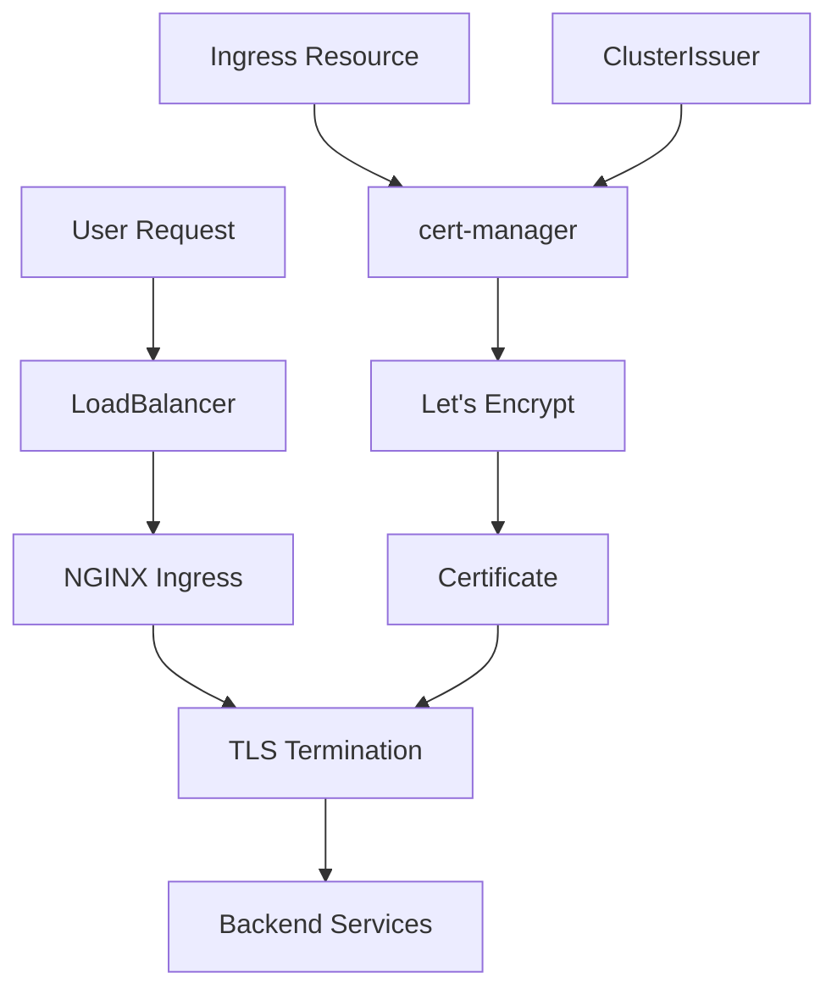

# SSL Certificate Management

This guide covers SSL/TLS certificate management using cert-manager and Let's Encrypt for your ZenML MLOps stack.

## 🔒 Certificate Architecture



## 📋 Certificate Flow

### 1. User Creates Ingress with TLS

```yaml
apiVersion: networking.k8s.io/v1
kind: Ingress
metadata:
  name: zenml-server
  namespace: zenml
  annotations:
    cert-manager.io/cluster-issuer: "letsencrypt-prod"
spec:
  tls:
  - hosts:
    - zenml.yourdomain.com
    secretName: zenml-tls-secret
  rules:
  - host: zenml.yourdomain.com
    http:
      paths:
      - path: /
        pathType: Prefix
        backend:
          service:
            name: zenml-server
            port:
              number: 8080
```

### 2. cert-manager Detects the Ingress
- Ingress controller watches all Ingress resources
- Sees `cert-manager.io/cluster-issuer` annotation
- Checks if certificate secret exists

### 3. Certificate Resource Created
cert-manager automatically creates:
```yaml
apiVersion: cert-manager.io/v1
kind: Certificate
metadata:
  name: zenml-certificate
  namespace: zenml
spec:
  secretName: zenml-tls-secret
  issuerRef:
    name: letsencrypt-prod
    kind: ClusterIssuer
  dnsNames:
  - zenml.yourdomain.com
```

### 4. ACME Challenge Process
1. **Order Creation**: cert-manager creates an ACME Order with Let's Encrypt
2. **Challenge Setup**: Creates HTTP-01 challenge
3. **Temporary Ingress**: Creates temporary route for `/.well-known/acme-challenge/`
4. **Let's Encrypt Validation**: LE checks if you control the domain
5. **Certificate Issuance**: LE issues the certificate if validation passes

### 5. Certificate Storage
- Certificate stored as Kubernetes Secret
- Secret contains: private key, certificate, CA bundle
- NGINX Ingress automatically uses the secret for TLS termination

## 🔧 ClusterIssuer Configuration

### Staging Issuer (for testing)

```yaml
apiVersion: cert-manager.io/v1
kind: ClusterIssuer
metadata:
  name: letsencrypt-staging
spec:
  acme:
    server: https://acme-staging-v02.api.letsencrypt.org/directory
    email: your-email@domain.com
    privateKeySecretRef:
      name: letsencrypt-staging
    solvers:
    - http01:
        ingress:
          class: nginx
```

### Production Issuer

```yaml
apiVersion: cert-manager.io/v1
kind: ClusterIssuer
metadata:
  name: letsencrypt-prod
spec:
  acme:
    server: https://acme-v02.api.letsencrypt.org/directory
    email: your-email@domain.com
    privateKeySecretRef:
      name: letsencrypt-prod
    solvers:
    - http01:
        ingress:
          class: nginx
```

## 🚀 Using Different Domain Options

### Option 1: nip.io (No DNS Setup)

Perfect for testing and development:

```yaml
# Example: 34.102.136.180.nip.io
apiVersion: networking.k8s.io/v1
kind: Ingress
metadata:
  name: zenml-server
  annotations:
    cert-manager.io/cluster-issuer: "letsencrypt-prod"
spec:
  tls:
  - hosts:
    - zenml.34.102.136.180.nip.io
    secretName: zenml-nip-tls
  rules:
  - host: zenml.34.102.136.180.nip.io
```

### Option 2: Custom Domain

For production use:

```yaml
apiVersion: networking.k8s.io/v1
kind: Ingress
metadata:
  name: zenml-server
  annotations:
    cert-manager.io/cluster-issuer: "letsencrypt-prod"
spec:
  tls:
  - hosts:
    - zenml.yourdomain.com
    secretName: zenml-custom-tls
  rules:
  - host: zenml.yourdomain.com
```

## 🔍 Certificate Status Monitoring

### Check Certificate Status

```bash
# List all certificates
kubectl get certificates -A

# Check specific certificate
kubectl describe certificate zenml-tls -n zenml

# Check certificate secret
kubectl get secret zenml-tls -n zenml -o yaml
```

### Certificate Status Examples

#### ✅ Working Certificate
```yaml
status:
  conditions:
  - type: Ready
    status: "True"
    reason: Ready
    message: Certificate is up to date and has not expired
  notAfter: "2025-11-29T10:30:45Z"
```

#### ⚠️ Staging Certificate
```yaml
status:
  conditions:
  - type: Ready
    status: "True" 
    reason: Ready
    message: Certificate is up to date and has not expired
  # Note: Browser will show "Not Secure" but certificate works
```

#### ❌ Failed Certificate
```yaml
status:
  conditions:
  - type: Ready
    status: "False"
    reason: Failed
    message: "Failed to finalize order: acme: error: 400..."
```

## 🛠️ Certificate Management

### Force Certificate Renewal

```bash
# Delete certificate to force renewal
kubectl delete certificate zenml-tls -n zenml

# Check if new certificate is being issued
kubectl get certificaterequests -n zenml -w
```

### Update Certificate Issuer

```bash
# Change from staging to production
kubectl patch ingress zenml-server -n zenml -p \
'{"metadata":{"annotations":{"cert-manager.io/cluster-issuer":"letsencrypt-prod"}}}'

# Delete existing certificate to trigger new one
kubectl delete certificate zenml-tls -n zenml
```

### Certificate Backup

```bash
# Backup certificate secret
kubectl get secret zenml-tls -n zenml -o yaml > zenml-cert-backup.yaml

# Restore certificate
kubectl apply -f zenml-cert-backup.yaml
```

## 🔧 Advanced Configuration

### Wildcard Certificates

For multiple subdomains:

```yaml
apiVersion: cert-manager.io/v1
kind: Certificate
metadata:
  name: wildcard-cert
  namespace: zenml
spec:
  secretName: wildcard-tls
  issuerRef:
    name: letsencrypt-prod
    kind: ClusterIssuer
  dnsNames:
  - "*.yourdomain.com"
  - "yourdomain.com"
```

### Custom Certificate Authority

For private CA:

```yaml
apiVersion: cert-manager.io/v1
kind: ClusterIssuer
metadata:
  name: private-ca-issuer
spec:
  ca:
    secretName: private-ca-key-pair
```

## 🚨 Troubleshooting

See our dedicated [Certificate Troubleshooting Guide](../troubleshooting/certificates.md) for:

- DNS validation failures
- Rate limiting issues
- Certificate not appearing in browser
- ACME challenge failures
- Migration from staging to production

## 📚 Best Practices

### Security
- Always use production issuers for public-facing services
- Keep email addresses up to date for certificate notifications
- Monitor certificate expiration dates
- Use staging issuer for testing to avoid rate limits

### Performance
- Use wildcard certificates for multiple subdomains
- Cache certificate secrets to reduce API calls
- Monitor cert-manager resource usage

### Maintenance
- Set up alerts for certificate expiration
- Regularly backup certificate secrets
- Test certificate renewal process
- Keep cert-manager updated

---

!!! tip "Testing Certificates"
    Always test with the staging issuer first to avoid hitting Let's Encrypt rate limits (50 certificates per registered domain per week).

!!! warning "Rate Limits"
    Let's Encrypt has rate limits. If you hit them, you'll need to wait or use the staging environment.

!!! info "Certificate Validity"
    Let's Encrypt certificates are valid for 90 days and auto-renew 30 days before expiration.