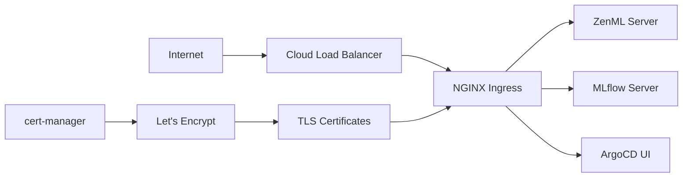

# Configuration

This section covers the configuration aspects of your ZenML MLOps stack, including HTTPS setup, certificate management, and secret handling.

## 🔧 Configuration Components

### Core Configuration Areas
- **HTTPS & Ingress** - Load balancer, ingress controller, and routing
- **[SSL Certificates](certificates.md)** - Automatic TLS certificate management
- **Secret Management** - Secure credential storage and access

### Supporting Configuration
- **DNS Management** - Domain configuration and routing
- **Service Accounts** - Identity and access management
- **Network Policies** - Traffic security and segmentation

## 🌐 Network Configuration

### Traffic Flow Architecture



### Domain Options

#### Option 1: nip.io (Development/Testing)
Perfect for quick testing without DNS setup:
```
zenml.34.102.136.180.nip.io
mlflow.34.102.136.180.nip.io
argocd.34.102.136.180.nip.io
```

#### Option 2: Custom Domain (Production)
Professional setup with your own domain:
```
zenml.yourdomain.com
mlflow.yourdomain.com
argocd.yourdomain.com
```

## 🔒 Security Configuration

### TLS/SSL Setup
- **Automatic certificates** via Let's Encrypt
- **HTTP to HTTPS redirect** enforced
- **Modern TLS versions** (1.2+) only
- **HSTS headers** for security

### Secret Management
- **External Secrets Operator** synchronizes from Google Secret Manager
- **Workload Identity** for secure pod authentication
- **Encrypted storage** for sensitive data
- **Least privilege access** via RBAC

## 📝 Configuration Files

### Essential Configuration Files

```
src/
├── zenml/
│   └── custom-values.yaml          # ZenML Helm chart customization
├── mlflow/
│   └── values.yaml                 # MLflow configuration
├── k8s-cluster/
│   ├── external-secrets/
│   │   └── secret-store.yaml       # Secret Manager connection
│   ├── cert-manager/
│   │   └── cluster-issuers.yaml    # Certificate issuers
│   └── ingress-nginx/
│       └── service.yaml            # Load balancer configuration
└── infra/
    └── terraform.tfvars            # Infrastructure variables
```

### Configuration Variables

#### Infrastructure Variables (terraform.tfvars)
```hcl
project_id   = "your-project-id"
project_name = "zenml-mlops"
region       = "us-central1"
zone         = "us-central1-a"

# Optional domain configuration
domain_name = "yourdomain.com"
```

#### Application Variables
```yaml
# ZenML configuration
zenml:
  serverURL: https://zenml.yourdomain.com
  database:
    url: mysql://zenml@10.x.x.x:3306/zenml

# MLflow configuration  
mysql:
  host: "10.x.x.x"
  database: "mlflow"
artifactRoot:
  gcs:
    bucket: "your-project-mlflow-artifacts"
```

## 🔄 Configuration Management

### Environment-Specific Configuration

#### Development Environment
```yaml
# Relaxed security for development
ingress:
  annotations:
    cert-manager.io/cluster-issuer: "letsencrypt-staging"
    
resources:
  requests:
    cpu: 100m
    memory: 256Mi
    
replicas: 1
```

#### Production Environment  
```yaml
# Production-ready configuration
ingress:
  annotations:
    cert-manager.io/cluster-issuer: "letsencrypt-prod"
    nginx.ingress.kubernetes.io/ssl-redirect: "true"
    
resources:
  requests:
    cpu: 500m
    memory: 1Gi
  limits:
    cpu: 2000m
    memory: 4Gi
    
replicas: 3
```

### Configuration Updates

#### GitOps Workflow
1. **Update configuration files** in Git repository
2. **Commit changes** to version control
3. **ArgoCD automatically syncs** changes to cluster
4. **Applications restart** with new configuration

#### Manual Updates
```bash
# Update Helm values
helm upgrade zenml-server oci://public.ecr.aws/zenml/zenml \
  -f custom-values.yaml \
  -n zenml

# Update ConfigMaps
kubectl create configmap app-config \
  --from-file=config.yaml \
  --dry-run=client -o yaml | kubectl apply -f -
```

## 🔍 Configuration Validation

### Pre-Deployment Checks
```bash
# Validate Terraform configuration
terraform validate
terraform plan

# Validate Kubernetes manifests
kubectl apply --dry-run=client -f manifest.yaml

# Validate Helm charts
helm template . --values values.yaml
```

### Post-Deployment Verification
```bash
# Check ingress configuration
kubectl get ingress --all-namespaces

# Verify certificates
kubectl get certificates --all-namespaces

# Test external access
curl -I https://zenml.yourdomain.com
```

## 🛠️ Customization Examples

### Custom Ingress Annotations
```yaml
apiVersion: networking.k8s.io/v1
kind: Ingress
metadata:
  annotations:
    nginx.ingress.kubernetes.io/rewrite-target: /
    nginx.ingress.kubernetes.io/ssl-redirect: "true"
    nginx.ingress.kubernetes.io/force-ssl-redirect: "true"
    nginx.ingress.kubernetes.io/proxy-body-size: "50m"
    nginx.ingress.kubernetes.io/rate-limit: "100"
```

### Custom Resource Limits
```yaml
resources:
  requests:
    cpu: "500m"
    memory: "1Gi"
    ephemeral-storage: "1Gi"
  limits:
    cpu: "2000m"  
    memory: "4Gi"
    ephemeral-storage: "10Gi"
```

### Custom Scaling Configuration
```yaml
autoscaling:
  enabled: true
  minReplicas: 2
  maxReplicas: 10
  targetCPUUtilizationPercentage: 70
  targetMemoryUtilizationPercentage: 80
```

## 📋 Detailed Configuration Guides

### HTTPS & Ingress Setup
- **NGINX Ingress Controller** - HTTP/HTTPS traffic routing and load balancing
- **Google Cloud Load Balancer** - External traffic distribution with static IP
- **Domain configuration** - Support for custom domains and nip.io wildcard DNS
- **SSL redirect** - Automatic HTTP to HTTPS redirection

### SSL Certificate Management
Complete TLS certificate automation with cert-manager:
- **Let's Encrypt integration** - Free, automatic SSL certificates
- **Staging and production issuers** - Test with staging, deploy with production
- **HTTP-01 challenge** - Domain validation via temporary ingress routes
- **Automatic renewal** - Certificates renew automatically 30 days before expiration

### Secret Management  
Secure credential handling with External Secrets Operator:
- **Google Secret Manager integration** - Centralized secret storage
- **Workload Identity** - Secure authentication without storing keys
- **Automatic synchronization** - Secrets sync from Secret Manager to Kubernetes
- **Secret rotation** - Support for credential rotation and updates

## 🚨 Common Configuration Issues

### Certificate Problems
- Incorrect domain DNS configuration  
- Let's Encrypt rate limiting
- ClusterIssuer misconfiguration
- Missing ingress annotations

### Ingress Issues
- LoadBalancer IP not assigned
- Incorrect service backend configuration
- Firewall blocking traffic
- DNS resolution failures

### Secret Management Issues
- Workload Identity not configured
- Secret Manager permissions missing
- External Secrets Operator not running
- Incorrect secret references

---

!!! tip "Configuration Best Practices"
    - Use staging certificates for testing
    - Version control all configuration files
    - Validate configurations before deployment
    - Monitor certificate expiration dates

!!! warning "Production Considerations"
    - Always use production certificate issuers for public services
    - Implement proper resource limits
    - Set up monitoring and alerting
    - Regular backup of configuration