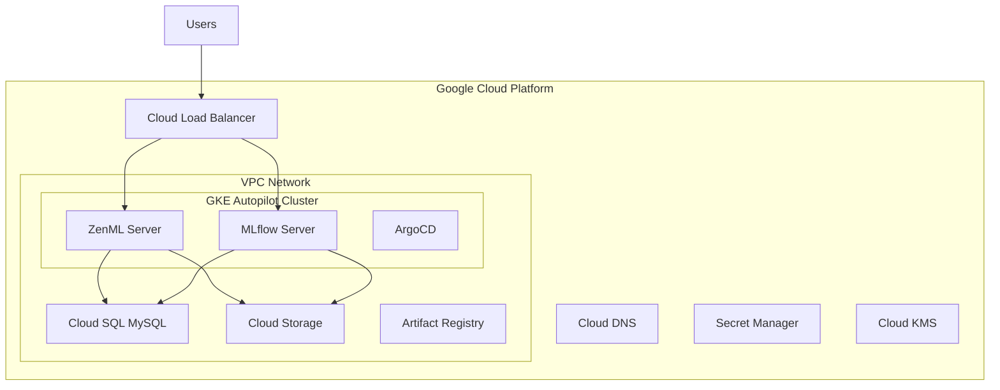

# Infrastructure

The ZenML MLOps stack is built on a robust, production-ready infrastructure on Google Cloud Platform using Infrastructure as Code (Terraform).

## 🏗️ Architecture Overview



## 📋 Infrastructure Components

### Core Services
- **GKE Autopilot** - Fully managed Kubernetes cluster
- **MySQL Database** - Cloud SQL for metadata storage
- **Networking & Security** - VPC, firewalls, and security
- **Terraform Modules** - Infrastructure as Code components

### Supporting Services
- **Cloud Storage** - Object storage for ML artifacts and models
- **Artifact Registry** - Container image storage
- **Secret Manager** - Secure credential storage
- **Cloud KMS** - Encryption key management
- **Cloud DNS** - Domain name resolution (optional)

## 🚀 Deployment Features

### Production-Ready
- **High Availability** - Multi-zone deployment options
- **Security** - Private networks, encryption, IAM
- **Scalability** - Auto-scaling clusters and storage
- **Monitoring** - Built-in observability and logging

### Cost-Optimized
- **Pay-per-use** - GKE Autopilot billing model
- **Efficient scaling** - Automatic resource management
- **Storage lifecycle** - Automated data retention policies
- **Resource optimization** - Right-sized instances

### DevOps-Friendly
- **Infrastructure as Code** - Version-controlled Terraform
- **GitOps** - Declarative application management
- **CI/CD Ready** - Integration with GitHub Actions
- **Modular Design** - Reusable Terraform modules

## 🔧 Module Structure

Our Terraform modules are organized for reusability and maintainability:

```
src/infra/
├── main.tf              # Root module configuration
├── variables.tf         # Input variables
├── outputs.tf          # Output values
├── terraform.tfvars    # Variable values
└── modules/
    ├── vpc/            # Networking infrastructure
    ├── gke/            # Kubernetes cluster
    ├── mysql/          # Database setup
    ├── security/       # IAM and encryption
    └── storage/        # Storage and registry
```

## 🌐 Network Architecture

### VPC Configuration
- **Custom VPC** with RFC 1918 IP ranges
- **Public subnet** for load balancers
- **Private subnet** for GKE nodes
- **Secondary ranges** for pods and services

### Security Features
- **Private GKE nodes** - No external IPs
- **Cloud NAT** - Controlled outbound access
- **Firewall rules** - Minimal required ports
- **Service networking** - Private database access

## 🔍 Monitoring & Observability

### Built-in Monitoring
- **Google Cloud Monitoring** - Infrastructure metrics
- **Google Cloud Logging** - Centralized log management
- **Health checks** - Service availability monitoring
- **Alerting** - Automated incident response

### Custom Metrics
- **Application metrics** via Prometheus
- **Business metrics** via MLflow tracking
- **Performance metrics** via ZenML dashboard
- **Cost metrics** via Cloud Billing API

## 📋 Detailed Infrastructure Components

### GKE Autopilot Cluster
- **Fully managed** Kubernetes service with automatic node management
- **Built-in security** with hardened nodes and automatic updates
- **Cost optimization** - pay only for CPU, memory, and storage used by pods
- **Workload Identity** enabled for secure GCP service authentication
- **Auto-scaling** based on resource requests and cluster demand

### Cloud SQL MySQL Database  
- **Private IP only** - accessible only within the VPC network
- **Automated backups** with point-in-time recovery (7-day retention)
- **SSL enforcement** with ENCRYPTED_ONLY mode for secure connections
- **Secret Manager integration** for secure credential storage
- **Default sizing** - db-n1-standard-2 (2 vCPUs, 7.5GB RAM, 20GB SSD)

### VPC Networking
- **Custom VPC** with RFC 1918 IP address ranges
- **Private subnets** for GKE nodes with no external IPs
- **Secondary IP ranges** for pods (10.1.0.0/16) and services (10.2.0.0/16)
- **Cloud NAT** for controlled outbound internet access
- **Private Service Access** for secure database connectivity

### Security & IAM
- **Service accounts** with least-privilege access principles
- **Workload Identity** binding between Kubernetes and GCP service accounts  
- **KMS encryption** for application-layer secrets
- **Secret Manager** for secure credential storage and rotation
- **Firewall rules** with minimal required ports and sources

## 🛠️ Customization

### Environment-Specific Configuration

```hcl
# Development
project_name = "zenml-dev"
environment  = "dev"
node_pools = {
  general = {
    node_count   = 1
    machine_type = "e2-small"
  }
}

# Production
project_name = "zenml-prod"
environment  = "prod"
node_pools = {
  general = {
    node_count   = 3
    machine_type = "e2-standard-4"
  }
}
```

### Multi-Region Deployment

```hcl
# Primary region
region = "us-central1"
zones  = ["us-central1-a", "us-central1-b", "us-central1-c"]

# Backup region (for disaster recovery)
backup_region = "us-east1"
```

## 🚨 Disaster Recovery

### Backup Strategy
- **Database backups** - Automated daily backups
- **Configuration backups** - Git repository
- **State backups** - Terraform state versioning
- **Application backups** - ArgoCD sync records

### Recovery Procedures
- **Point-in-time recovery** - Database restoration
- **Infrastructure recreation** - Terraform apply
- **Application redeployment** - ArgoCD sync
- **Data restoration** - Storage bucket recovery

---

!!! tip "Getting Started"
    New to infrastructure? Start with our [Quick Start Guide](../getting-started/quick-start.md) for a simple deployment.

!!! info "Production Features"
    The [Quick Start Guide](../getting-started/quick-start.md) includes production-ready configurations including custom domains, HTTPS, and security settings.