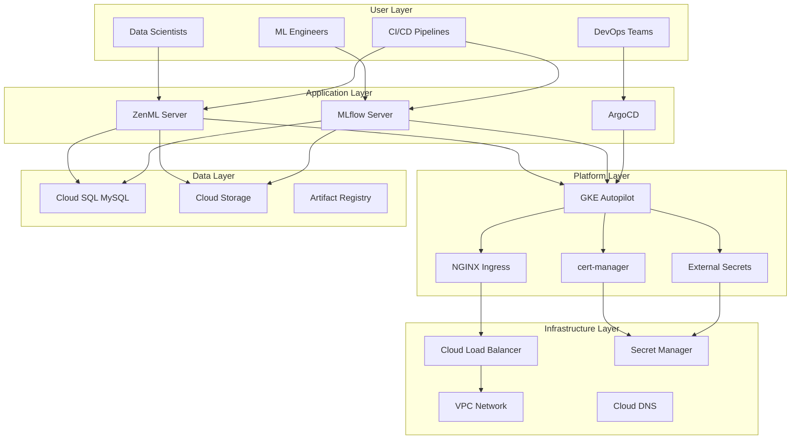

# Reference

This section provides comprehensive reference materials for the ZenML MLOps stack, including command references, architecture details, and optimization guides.

## 📚 Reference Materials

### Quick Reference
- **Commands** - Essential commands and troubleshooting (see sections below)
- **Architecture** - Detailed system architecture and design (see sections below)
- **Cost Optimization** - Cost management and optimization strategies (see sections below)

### Technical Specifications
- **Resource Requirements** - Minimum and recommended specifications
- **API References** - ZenML and MLflow API documentation
- **Configuration Schema** - Complete configuration options

## 🏗️ System Architecture

### High-Level Architecture



### Component Specifications

| Component | Version | Purpose | Resource Requirements |
|-----------|---------|---------|----------------------|
| **GKE Autopilot** | Latest | Kubernetes platform | Auto-managed |
| **ZenML Server** | 0.84+ | ML orchestration | 500m CPU, 1Gi RAM |
| **MLflow Server** | 2.22+ | Experiment tracking | 200m CPU, 512Mi RAM |
| **ArgoCD** | 2.9+ | GitOps platform | 250m CPU, 512Mi RAM |
| **NGINX Ingress** | 1.9+ | Traffic routing | 100m CPU, 128Mi RAM |
| **cert-manager** | 1.13+ | Certificate management | 50m CPU, 128Mi RAM |

## 💰 Cost Structure

### Monthly Cost Breakdown

| Service Category | Components | Estimated Cost |
|-----------------|------------|----------------|
| **Compute** | GKE Autopilot, Load Balancer | $92+ |
| **Database** | Cloud SQL MySQL | $100+ |
| **Storage** | Cloud Storage, Artifact Registry | $10+ |
| **Networking** | Egress, DNS | $5+ |
| **Total** | All components | **~$207+** |

### Cost Variables
- **Usage patterns** - Active development vs. production
- **Data volume** - Artifacts, models, and logs
- **Geographic region** - Pricing varies by region
- **Resource utilization** - Actual vs. provisioned resources

## 🔧 Configuration Reference

### Terraform Variables

#### Required Variables
```hcl
variable "project_id" {
  description = "Google Cloud Project ID"
  type        = string
}

variable "project_name" {
  description = "Project name for resource naming"
  type        = string
}

variable "region" {
  description = "Google Cloud region"
  type        = string
  default     = "us-central1"
}
```

#### Optional Variables
```hcl
variable "domain_name" {
  description = "Custom domain name for services"
  type        = string
  default     = null
}

variable "enable_backup" {
  description = "Enable automated backups"
  type        = bool
  default     = true
}

variable "environment" {
  description = "Environment name (dev, staging, prod)"
  type        = string
  default     = "dev"
}
```

### Helm Chart Values

#### ZenML Configuration
```yaml
# Resource allocation
resources:
  requests:
    cpu: 500m
    memory: 1Gi
  limits:
    cpu: 2000m
    memory: 4Gi

# Scaling configuration
autoscaling:
  enabled: true
  minReplicas: 1
  maxReplicas: 5
  targetCPUUtilizationPercentage: 70

# Security configuration
serviceAccount:
  annotations:
    iam.gke.io/gcp-service-account: zenml@project.iam.gserviceaccount.com

# Database configuration
zenml:
  database:
    url: mysql://zenml@10.x.x.x:3306/zenml
    sslMode: PREFERRED
```

#### MLflow Configuration
```yaml
# Image configuration
image:
  repository: public.ecr.aws/zenml/mlflow-server
  tag: "2.22.2"
  
# Storage configuration
artifactRoot:
  gcs:
    enabled: true
    bucket: "project-mlflow-artifacts"
    
# Database configuration
mysql:
  enabled: true
  host: "10.x.x.x"
  port: 3306
  database: "mlflow"
```

## 🌐 Network Configuration

### IP Address Ranges

```hcl
# VPC CIDR blocks
vpc_cidr = "10.0.0.0/16"

# Subnet configurations
subnet_cidrs = {
  primary   = "10.0.1.0/24"    # Node subnet
  secondary = "10.0.2.0/24"    # Reserved
  pods      = "10.1.0.0/16"    # Pod IP range
  services  = "10.2.0.0/16"    # Service IP range
}

# Master network (private)
master_ipv4_cidr_block = "172.16.0.0/28"
```

### Firewall Rules

| Rule Name | Direction | Ports | Source | Purpose |
|-----------|----------|-------|--------|---------|
| `allow-ingress-80-443` | Ingress | 80,443 | 0.0.0.0/0 | HTTP/HTTPS traffic |
| `allow-gke-nodes` | Ingress | All | Node subnet | Inter-node communication |
| `allow-mysql` | Ingress | 3306 | Pod subnet | Database access |

## 📊 Performance Benchmarks

### Expected Performance

| Metric | Development | Production |
|--------|-------------|------------|
| **ZenML API Response** | < 500ms | < 200ms |
| **MLflow UI Load** | < 2s | < 1s |
| **Pipeline Execution** | Variable | Variable |
| **Database Queries** | < 100ms | < 50ms |

### Scaling Thresholds

| Component | Scale Up Trigger | Scale Down Trigger |
|-----------|-----------------|-------------------|
| **ZenML Server** | CPU > 70% | CPU < 30% for 5m |
| **MLflow Server** | CPU > 80% | CPU < 20% for 10m |
| **Database** | Connections > 80% | Manual scaling |

## 🔐 Security Reference

### IAM Roles and Permissions

#### ZenML Service Account
```json
{
  "roles": [
    "roles/secretmanager.secretAccessor",
    "roles/cloudsql.client", 
    "roles/storage.admin"
  ],
  "workloadIdentity": "zenml/zenml-server"
}
```

#### MLflow Service Account
```json
{
  "roles": [
    "roles/secretmanager.secretAccessor",
    "roles/cloudsql.client",
    "roles/storage.objectAdmin"
  ],
  "workloadIdentity": "mlflow/mlflow"
}
```

### Security Controls

| Control Type | Implementation | Status |
|-------------|----------------|--------|
| **Encryption at Rest** | Cloud KMS + disk encryption | ✅ Enabled |
| **Encryption in Transit** | TLS 1.2+ everywhere | ✅ Enforced |
| **Network Isolation** | Private GKE nodes | ✅ Configured |
| **Secret Management** | External Secrets Operator | ✅ Deployed |
| **Access Control** | Workload Identity + RBAC | ✅ Configured |

## 🛠️ Troubleshooting Reference

### Common Error Codes

| Error Pattern | Likely Cause | Solution |
|---------------|--------------|----------|
| `503 Service Unavailable` | Backend pods not ready | Check pod status and logs |
| `SSL_ERROR_*` | Certificate issues | Verify cert-manager and DNS |
| `Connection refused` | Service not running | Check service and endpoints |
| `403 Forbidden` | RBAC/IAM permissions | Review service account permissions |

### Debug Commands

```bash
# Cluster-wide health
kubectl get nodes
kubectl get pods --all-namespaces

# Application-specific
kubectl describe application zenml-server -n argocd
kubectl logs -n zenml deployment/zenml-server -f

# Network troubleshooting  
kubectl get ingress,svc,endpoints --all-namespaces
kubectl describe ingress zenml-server -n zenml

# Certificate troubleshooting
kubectl get certificates,certificaterequests --all-namespaces
kubectl describe certificate zenml-tls -n zenml
```

## 📚 External References

### Documentation Links
- [ZenML Documentation](https://docs.zenml.io/)
- [MLflow Documentation](https://mlflow.org/docs/latest/)
- [ArgoCD Documentation](https://argo-cd.readthedocs.io/)
- [Google Cloud Documentation](https://cloud.google.com/docs)
- [Kubernetes Documentation](https://kubernetes.io/docs/)

### Community Resources
- [ZenML GitHub](https://github.com/zenml-io/zenml)
- [MLflow GitHub](https://github.com/mlflow/mlflow)
- [ArgoCD GitHub](https://github.com/argoproj/argo-cd)
- [ZenML Slack](https://zenml.io/slack-invite/)

---

!!! tip "Keep This Updated"
    This reference section should be updated as the stack evolves and new versions are deployed.

!!! info "Version Compatibility"
    Always check component compatibility when upgrading versions.